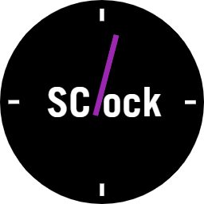
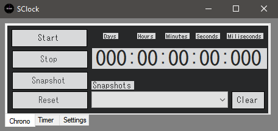
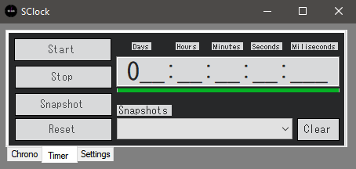
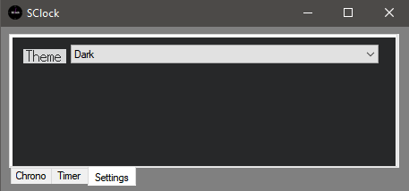

# Clock

    

<h1 align="center">SClock</h1>

> ## التقنيات المستخدمة 
> اللغة/Language : c# | اطار العمل/Framework : .Net framwork(4.8) | المكتبة الرسومية/UI library : winForms  

تطبيق وقت بسيط انشاته اتناء تعلمي     
  
## الوضائف الاساسية :    
###  موقت تصاعدي (Chrono)   
  
لحساب فترة زمنية معينة بدون تحديد.  
  المكونات الساسية :  
    * زر البدا (start button)      : بدا/استئناف الموقت  
    * زر التوقف (stop button)      : لايقاف الموقت  
    * زر التسجيل (snapshot button) : لحفض الوقت الحالي  
    * زر اعادة التعيين (reset button) : لاعادة تعيين الموقت   
    * لائحة التسجيل (snapshots list): للاطلاع على التسجيلات     
  
### موقت تنازلي (Timer)    
  
وضع فترة زمنية معينة وتلقي اشعار عند انتهاءه.  
  المكونات الساسية :  
    * زر البدا (start button)      : بدا/استئناف الموقت  
    * زر التوقف (stop button)      : لايقاف الموقت  
    * زر التسجيل (snapshot button) : لحفض الوقت الحالي  
    * زر اعادة التعيين (reset button) : لاعادة تعيين الموقت   
    * لائحة التسجيل (snapshots list): للاطلاع على التسجيلات   

### المظهر (Theme)    
  
تغيير المظهر العام للبرنامج.  
  المكونات الساسية :    
* المظهر االساطع (Light theme)      : مظهر ساطع مناسب لصباح  
* المظهر المظلم (Dark theme)      : مظهر مظلم مناسب لليل    
<ملاحضة   
<افكر في اضافة ميزة تخصيص المظهر لاحقا    
  
## طريقة تشغيل المشروع    
1. انتقل الى git bash , cmd   
2. اكتب :    
'''bash  
git clone https://github.com/youssef-ghorab/Learning-SimpleClock  
'''  
3. انتقل الى مجلد امشرع تم اضغط مرتين على SClock.sln لفتحه في Virual studio   
4. اضغط على F5 ليبدا التشغيل

